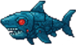
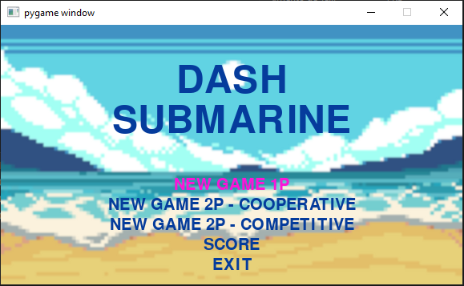
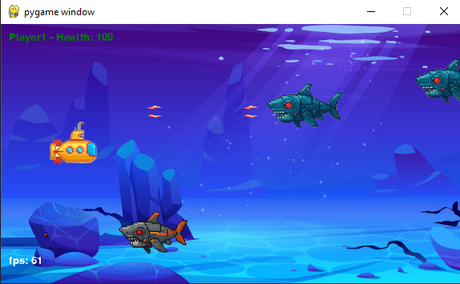

<table align="center">
  <tr>
    <td></td>
    <td align="center">
      <h1 style="margin: 0; font-weight: bold;">Dash Submarine 🌊🚤</h1>
    </td>
    <td></td>
  </tr>
</table>

<p align="center">
 <a href="#sobre">Sobre</a> • 
 <a href="#tecnologias">Tecnologias</a> • 
 <a href="#funcionalidades">Funcionalidades</a> • 
 <a href="#como-rodar">Como Rodar</a> • 
 <a href="#preview">Preview</a> 
</p>

<h2 id="sobre">🎯 Sobre</h2>

DashSubmarine é um jogo 2D desenvolvido em **Python** com **Pygame**.  
O jogador controla um submarino e deve **desviar de ataques e destruir tubarões mecânicos**.  
O jogo suporta **modo cooperativo para 2 jogadores** e mantém a pontuação em um banco de dados SQLite3.  

O projeto foi criado para fins de estudo, mas contribuições são bem-vindas!  

<h2 id="tecnologias">💻 Tecnologias</h2>

<div>
  
  <span>Python</span>
</div>
<div>
  
  <span>SQLite3</span>
</div>
<div>
  <span>Pygame</span>
</div>

<h2 id="funcionalidades">🕹️ Funcionalidades</h2>

- **Destruir Inimigos**: Atire nos tubarões mecânicos antes que eles destruam você.  
- **Desviar de Ataques**: Movimente o submarino para evitar tiros e obstáculos.  
- **Modo Co-op**: Dois jogadores podem jogar simultaneamente.  
- **Sistema de Pontuação**: Pontos são salvos em um banco de dados SQLite3.  
- **Níveis Progressivos**: Diferentes desafios em cada nível.  

<h2 id="como-rodar">🚀 Como Rodar</h2>

### Pré-requisitos

Antes de rodar o projeto, certifique-se de ter instalado:

- **Python 3** (https://www.python.org/downloads/)  
- **Pygame**: Instale via pip:
```bash
pip install pygame

```
<h2 id="preview">📸 Preview do Projeto</h2>

  

  
